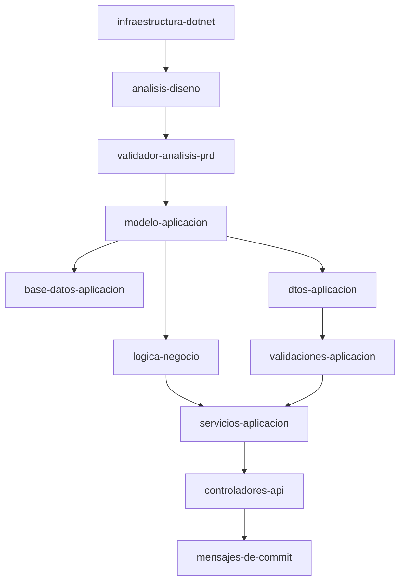
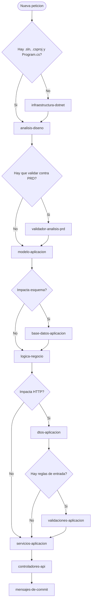

# Documentacion de Orquestacion de Skills

## Objetivo

Mantener vivo y sincronizado el documento `documentacion/skills-orquestacion.md`, de forma que explique con texto y diagramas Mermaid como se coordinan las skills locales del repositorio, en que orden se usan y que dependencias reales las conectan.

## Cuando usar este skill

- Cuando se crea, renombra o elimina cualquier skill en `.github/skills/`.
- Cuando cambia la secuencia canonica de ejecucion entre skills.
- Cuando una dependencia nueva obliga a reordenar pasos o gates.
- Cuando el usuario pide documentar, actualizar o explicar la orquestacion de skills.
- Cuando haga falta dejar trazabilidad de por que una skill depende de otra.

## Fuentes de verdad

- `.github/skills/*/SKILL.md`
- `.github/copilot-instructions.md`
- `README.md`
- `documentacion/PRD.md`, si existe y aporta contexto funcional
- `documentacion/analisis-diseño.md` o `documentacion/analisis-diseno.md`, si existe y aporta contexto tecnico
- `documentacion/repositorios-skills.md`
- `labs/GHCOPTL-M4.7-lab.md`, como guia pedagogica de referencia

## Procedimiento

1. Leer el inventario real de skills locales y localizar sus rutas.
2. Identificar la secuencia canonica y las dependencias que de verdad aplican en este repositorio.
3. Abrir `documentacion/skills-orquestacion.md` si ya existe y detectar que se ha quedado desactualizado.
4. Actualizar el documento con solo hechos reales, sin inventar skills ni dependencias.
5. Usar Mermaid para los diagramas, nunca imagenes externas.
6. Documentar el propio proceso de actualizacion dentro del archivo, para que el documento sirva tambien como guia de mantenimiento.
7. Revisar que el resultado siga siendo legible para una persona nueva y util como contexto para Copilot.

## Estructura esperada del documento

El archivo `documentacion/skills-orquestacion.md` debe mantenerse con estas secciones, en este orden:

1. Objetivo y alcance.
2. Inventario de skills locales.
3. Secuencia canonica de uso.
4. Mapa de dependencias en Mermaid.
5. Arbol de decision para elegir la siguiente skill.
6. Convenciones de nombres, rutas y gates.
7. Proceso de actualizacion del documento.
8. Pendientes o huecos detectados.

## Reglas de redaccion

- Redactar en castellano.
- Describir el estado real del repositorio, no el estado deseado.
- Si falta una skill o una dependencia, dejarlo como pendiente en lugar de inventarlo.
- Si el repositorio cambia, actualizar el inventario y los diagramas en la misma tarea.
- Mantener el documento en Markdown plano para que el diff sea revisable y el Mermaid se regenere solo.

## Esqueleto de los diagramas Mermaid

El documento debe incluir, como minimo, estos dos diagramas:

## Criterios de calidad

- El documento debe reflejar la foto actual del repo.
- Cada skill local relevante debe quedar inventariada con su ruta.
- Cada dependencia debe poder justificarse leyendo el SKILL.md correspondiente.
- Cada cambio en skills debe dejar rastro en el documento sin romper la lectura.
