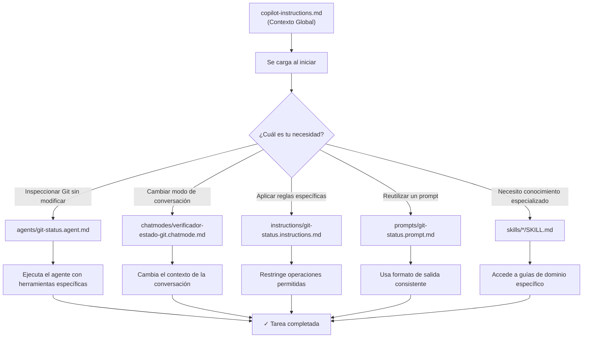
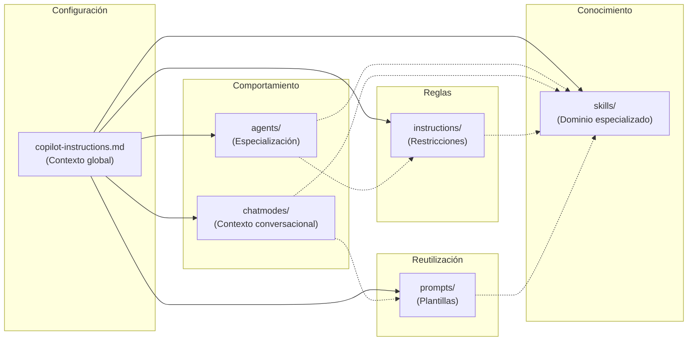
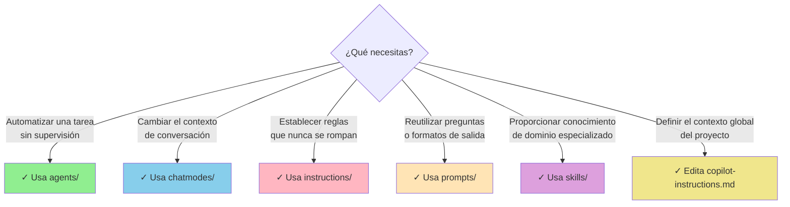
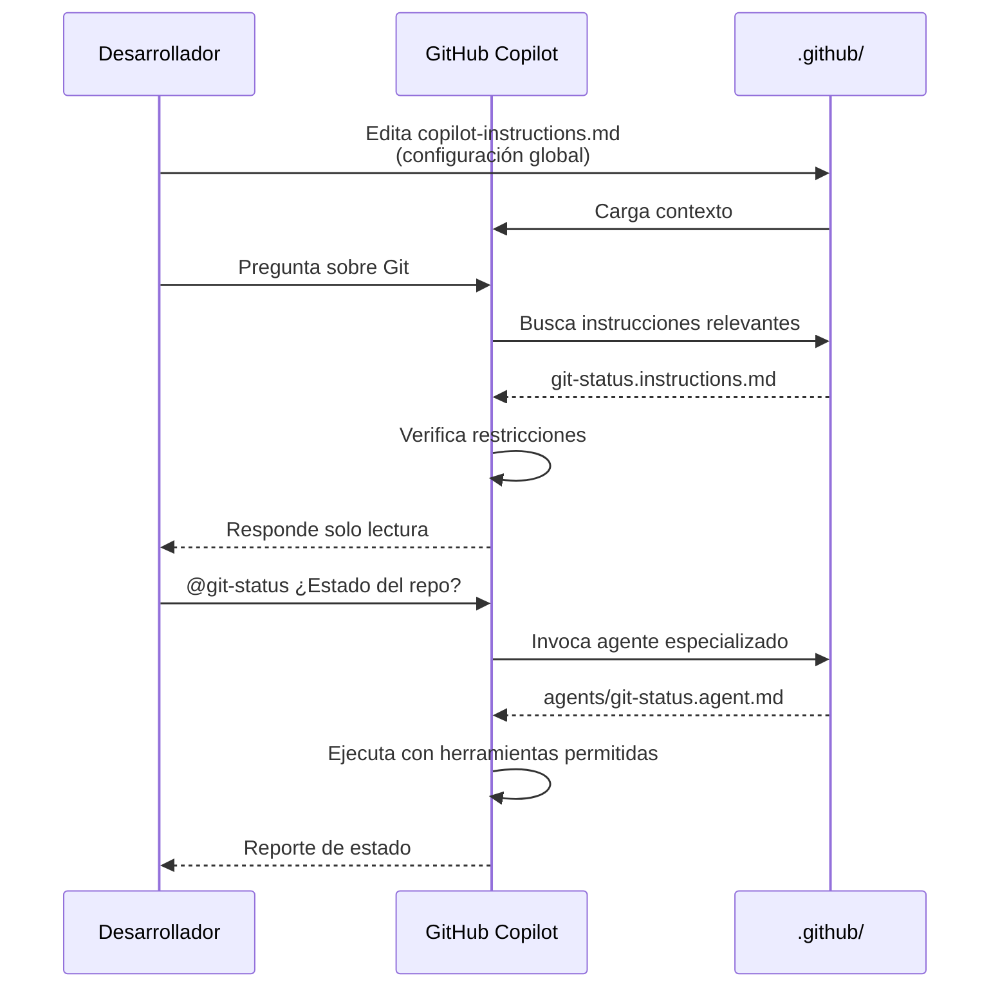

# Estructura de la carpeta `.github` — Guía Tutorial

Documentación completa sobre la organización de carpetas dentro de `.github` y cómo configurar y extender los comportamientos de GitHub Copilot en este proyecto.

## Visión general

La carpeta `.github` es el **centro de control de Copilot** en este proyecto. Aquí defines cómo debe comportarse el agente, qué herramientas tiene disponibles, qué instrucciones debe seguir, y qué conocimiento especializado puede aplicar. Piensa en ella como un **manual de operaciones personalizado** para tu asistente de IA.

### Estructura general

```
.github/
├── agents/                      # Definiciones de agentes especializados
│   └── git-status.agent.md      # Agente para inspeccionar Git (solo lectura)
├── chatmodes/                   # Modos de conversación personalizados
│   └── verificador-estado-git.chatmode.md
├── instructions/                # Reglas y restricciones operacionales
│   └── git-status.instructions.md
├── prompts/                      # Plantillas de prompts reutilizables
│   └── git-status.prompt.md
├── skills/                       # Habilidades especializadas por dominio
│   ├── security-review/
│   ├── base-datos-aplicacion/
│   ├── controladores-api/
│   ├── logica-negocio/
│   └── ... (más skills)
└── copilot-instructions.md       # Configuración y contexto global
```

---

## Diagrama de flujo: Cómo funciona todo junto



---

## Carpetas detalladas

### 📁 `agents/` — Agentes especializados

**¿Qué es un agente?**

Un agente es una **versión especializada de Copilot** que está configurada para realizar una tarea específica sin desviarse. Tienes control total sobre:
- Qué modelo de IA usa
- Qué herramientas tiene disponibles
- Cómo debe comportarse
- Qué restricciones debe respetar

**Ejemplo real: `git-status.agent.md`**

Este agente está diseñado para inspeccionar el repositorio Git **sin hacer ninguna modificación**. Solo puede:
- ✅ Leer archivos (`read_file`)
- ✅ Ejecutar comandos de lectura (`run_in_terminal`)
- ✅ Buscar en el código (`grep_search`)

Pero **NO puede**:
- ❌ Hacer commits
- ❌ Hacer push
- ❌ Crear ramas
- ❌ Hacer cambios en archivos

**Estructura de un archivo `.agent.md`**

```yaml
---
description: Breve descripción del agente
model: GPT-4o
tools: [read_file, run_in_terminal, grep_search]
---

## Instrucciones

Aquí va el prompt o las instrucciones que define cómo actúa el agente.
```

**¿Cuándo usar agentes?**

- Cuando quieras automatizar una tarea compleja sin supervisión
- Cuando necesites garantizar que ciertas operaciones **nunca** ocurran
- Cuando desees reutilizar el mismo comportamiento múltiples veces
- Cuando trabajes con tareas críticas que requieren precisión (seguridad, auditoría)

**Cómo invocar un agente**

En VS Code, simplemente menciona el nombre del agente en el chat de Copilot:
```
@git-status ¿Cuál es el estado actual del repositorio?
```

---

### 🎭 `chatmodes/` — Modos de conversación personalizados

**¿Qué es un chat mode?**

Un chat mode es una **personalización del contexto** de conversación. Cuando activas un modo de chat, Copilot cambia su forma de responder, enfoque y restricciones para ese contexto específico.

Es como cambiar el "sombrero" que lleva el asistente: un sombrero de auditor, otro de revisor de código, otro de asistente didáctico, etc.

**Ejemplo real: `verificador-estado-git.chatmode.md`**

Este modo prepara a Copilot para actuar como un verificador de Git enfocándose en:
- Inspeccionar cambios pendientes
- Verificar conflictos de merge
- Listar ramas locales y remotas
- Alertar sobre problemas de sincronización

**Estructura de un archivo `.chatmode.md`**

```yaml
---
name: Verificador Estado Git
description: Modo de chat especializado para auditoría de repositorio
icon: git-branch
---

## Comportamiento

Instrucciones sobre cómo debe actuar Copilot en este modo.

## Restricciones de herramientas

Qué puede y qué no puede hacer.
```

**¿Cuándo usar chat modes?**

- Cuando quieras cambiar el "rol" de Copilot para una sesión de trabajo
- Cuando necesites un conjunto consistente de restricciones por contexto
- Cuando trabajes con diferentes tipos de tareas (auditoría, desarrollo, documentación)
- Cuando quieras entrenar a nuevos miembros del equipo en procedimientos estándar

---

### 📋 `instructions/` — Reglas y restricciones

**¿Qué son las instrucciones?**

Las instrucciones son **reglas operacionales** que aplican a tareas o archivos específicos. Son como un **manual de procedimientos** que Copilot debe respetar al trabajar.

A diferencia de los agentes (que son "personas" completas especializadas), las instrucciones son más bien **reglamentos** que se aplican en contextos particulares.

**Ejemplo real: `git-status.instructions.md`**

Este archivo especifica explícitamente:

```markdown
# Instrucciones: Git Status

## ✅ Operaciones permitidas

- Lectura de archivos del repositorio
- Ejecución de comandos git de consulta
- Búsqueda y análisis de código
- Generación de reportes de estado

## ❌ Operaciones prohibidas

- NO hacer commits
- NO hacer push o pull
- NO crear o eliminar ramas
- NO hacer merge o rebase
- NO modificar archivos
```

**Cómo se aplican automáticamente**

Las instrucciones se asocian a archivos o patrones usando `applyTo`. Por ejemplo:

```yaml
---
applyTo: "**/*.git*"
---
```

Esto significa: "Estas instrucciones aplican a cualquier archivo relacionado con Git".

**¿Cuándo usar instructions?**

- Cuando necesites reglas que se apliquen automáticamente a ciertos archivos
- Cuando quieras establecer guardrails (barreras de seguridad) en el código
- Cuando requieras que ciertas operaciones nunca ocurran sin excepciones
- Cuando quieras documentar restricciones que nuevos miembros del equipo deben respetar

---

### 🎨 `prompts/` — Plantillas de prompts reutilizables

**¿Qué es un prompt template?**

Un prompt template es una **plantilla de pregunta** o **instrucción predefinida** que puedes reutilizar múltiples veces. Estandariza cómo haces preguntas comunes.

**Ejemplo real: `git-status.prompt.md`**

En lugar de escribir cada vez:
```
¿Cuál es el estado actual del repositorio? 
Por favor dame:
1. Rama actual
2. Cambios sin stagear
3. Conflictos pendientes
...
```

Tienes una plantilla que Copilot puede usar directamente.

**Estructura de un archivo `.prompt.md`**

```markdown
---
name: Revisión de Estado Git
description: Plantilla para inspeccionar el estado del repositorio
---

## Prompt template

[Tu pregunta o instrucción aquí]

## Formato de salida esperado

```json
{
  "rama_actual": "...",
  "cambios_pendientes": [...],
  "conflictos": [...]
}
```

## Ejemplos

Ejemplo 1: ...
Ejemplo 2: ...
```

**¿Cuándo usar prompts?**

- Cuando repites la misma pregunta frecuentemente
- Cuando necesitas output en un formato consistente (JSON, tabla, etc.)
- Cuando quieras documentar preguntas frecuentes del equipo
- Cuando necesites entrenar al agente en cómo responder ciertos tipos de consultas

---

### 🔧 `skills/` — Habilidades especializadas por dominio

**¿Qué es un skill?**

Un skill es un **paquete de conocimiento especializado** sobre un dominio o tecnología. Contiene:
- Instrucciones paso a paso
- Mejores prácticas
- Ejemplos de código
- Patrones y anti-patrones
- Referencias a documentación

Piensa en skills como "manuales de experto" que Copilot puede consultar.

**Estructura típica de un skill**

```
skills/
└── base-datos-aplicacion/
    ├── SKILL.md           # Guía principal
    ├── ejemplos/
    │   ├── contexto-basico.cs
    │   └── migracion-completa.sql
    └── patrones/
        ├── relaciones.md
        └── consultas-optimas.md
```

**Ejemplo real: `base-datos-aplicacion/SKILL.md`**

Este skill enseña cómo:
- Crear un DbContext en Entity Framework Core
- Configurar migraciones
- Escribir consultas optimizadas
- Evitar problemas comunes (N+1 queries)
- Registrar el contexto en `Program.cs`

**Skills disponibles en este proyecto**

| Skill | Propósito |
|-------|-----------|
| `security-review` | Auditoría de seguridad y vulnerabilidades |
| `base-datos-aplicacion` | Entity Framework Core y SQLite |
| `controladores-api` | Endpoints ASP.NET Core |
| `logica-negocio` | Reglas y validaciones de dominio |
| `servicios-aplicacion` | Capas de servicios y orquestación |
| `modelo-aplicacion` | Clases de modelo de dominio |
| `infraestructura-dotnet` | Verificación de estructura de solución |
| `validaciones-aplicacion` | DTOs y validación de entrada |
| Y más... | |

**¿Cuándo usar skills?**

- Cuando Copilot necesite conocimiento especializado sobre una tecnología
- Cuando implemente features en un dominio determinado
- Cuando quieras estandarizar cómo se hace algo (ej: siempre usar Entity Framework así)
- Cuando necesites que Copilot explique conceptos complejos del proyecto

**Cómo invocar un skill**

Simplemente menciona en el chat que necesitas algo relacionado con el skill:
```
Necesito crear un servicio de aplicación para gestionar usuarios.
```

Copilot automáticamente consultará el skill `servicios-aplicacion` si lo reconoce como relevante.

---

### ⚙️ `copilot-instructions.md` — Configuración global

**¿Qué es?**

Es el **archivo de configuración principal** del proyecto. Se carga automáticamente cuando trabajas en este proyecto y establece:
- Quién eres (el equipo de desarrollo)
- Qué proyecto es este
- Qué tecnologías se usan
- Qué estilos de código se esperan
- Qué convenciones de nombres seguir
- Cuáles son los objetivos del proyecto

**¿Es obligatorio editar?**

No siempre, pero es **muy recomendable** personalizar este archivo para que refleje:
1. Las preferencias de tu equipo
2. Las decisiones arquitectónicas del proyecto
3. Las restricciones técnicas
4. Los estándares de calidad

**Estructura típica**

```markdown
# Instrucciones de Copilot para [Tu Proyecto]

## Resumen del proyecto
[Descripción breve]

## Directrices de arquitectura
[Patrones y decisiones clave]

## Convenciones de nombres
[Cómo nombrar clases, métodos, variables, etc.]

## Organización de carpetas
[Estructura esperada de directorios]

## Habilidades
[Links a skills disponibles]

## Agentes
[Agentes disponibles para este proyecto]
```

**Mejor práctica**

Mantén este archivo **actualizado** cada vez que:
- Cambies la arquitectura
- Agregues nuevos skills
- Establezcas nuevas convenciones
- Documentes nuevas restricciones técnicas

---

## Diagrama: Relación entre componentes



---

## Cuándo usar cada componente: Matriz de decisión



---

## Flujo de trabajo típico



---

## Mejores prácticas

### 📝 Naming (Nomenclatura)

Usa **guiones** (kebab-case) en nombres de archivo, nunca camelCase:

```
✅ CORRECTO:
- git-status.agent.md
- verificador-estado-git.chatmode.md
- base-datos-aplicacion/

❌ INCORRECTO:
- gitStatus.agent.md
- verificadorEstadoGit.chatmode.md
- baseDatosAplicacion/
```

**Razón**: Los guiones son más legibles en URLs y línea de comandos, y siguen convenciones de GitHub.

---

### 🏗️ Granularidad

Cada carpeta debe tener un propósito único y bien definido:

```
✅ CORRECTO:
skills/
├── base-datos-aplicacion/  (Responsabilidad clara)
├── controladores-api/      (Responsabilidad clara)
└── logica-negocio/         (Responsabilidad clara)

❌ INCORRECTO:
skills/
└── todo/                   (Demasiado general)
```

---

### 📚 Documentación

Cada carpeta debe tener un archivo README o descriptor claro:

```
agents/
├── README.md                    (Describe qué agentes hay)
├── git-status.agent.md
└── ... otros agentes

skills/
├── AGENTS.md                    (Registro de skills)
└── */SKILL.md                   (Cada skill con su doc)
```

---

### 🔒 Versionado en Git

Todos estos archivos deben estar en Git. Son parte de tu **"cerebro"** de Copilot:

```bash
git add .github/
git commit -m "docs: actualizar configuración de Copilot"
git push
```

---

### 🎯 Consistencia de YAML

Mantén frontmatter YAML consistente en todos los archivos:

```yaml
---
description: "Descripción breve"
model: "GPT-4o"
tools: [tool1, tool2, tool3]  # Array de herramientas
---
```

---

## Ejemplos prácticos

### Ejemplo 1: Crear un nuevo agente para auditoría de código

**Archivo**: `.github/agents/security-audit.agent.md`

```yaml
---
description: Agente especializado en auditoría de seguridad de código
model: GPT-4o
tools: [read_file, grep_search, semantic_search]
---

## Misión

Revisar código en busca de vulnerabilidades OWASP Top 10.

## Herramientas disponibles

- read_file: Para examinar archivos
- grep_search: Para buscar patrones vulnerables
- semantic_search: Para análisis contextual

## Restricciones

❌ NO modificar código
❌ NO ejecutar comandos
✅ SOLO lectura y análisis
```

**Uso**:
```
@security-audit ¿Hay vulnerabilidades de SQL injection en Controllers/?
```

---

### Ejemplo 2: Crear un nuevo chat mode para pair programming

**Archivo**: `.github/chatmodes/pair-programming.chatmode.md`

```yaml
---
name: Pair Programming
description: Modo conversacional para desarrollo colaborativo
color: blue
---

## Comportamiento

- Explica cada paso que va a hacer
- Sugiere alternativas antes de implementar
- Detiene el flujo para pedir confirmación en decisiones importantes
- Hace preguntas sobre el diseño antes de programar

## Restricciones

- Solo puede leer/crear/editar archivos si el usuario lo aprueba
- Debe mostrar diffs antes de aplicar cambios
```

---

### Ejemplo 3: Crear restricciones para archivos de configuración

**Archivo**: `.github/instructions/config-files.instructions.md`

```yaml
---
applyTo: "{appsettings,*.config}.json"
description: Restricciones para archivos de configuración
---

## ❌ Prohibido

- Nunca modifiques valores de conexión a base de datos
- No cambies secretos sin aprobación explícita
- No edites configuraciones de seguridad

## ✅ Permitido

- Leer y reportar valores actuales
- Sugerir cambios (pero no aplicarlos)
- Alertar sobre configuraciones inseguras
```

---

## Integración con el flujo de trabajo del equipo

### Durante la revisión de código (Code Review)

1. **Instrucciones de review** en `.github/instructions/`
2. **Chat mode de reviewer** en `.github/chatmodes/`
3. **Prompt template** en `.github/prompts/` con checklist estándar

```
@code-reviewer Revisar PR #42 según el checklist de proyecto
```

---

### Durante la implementación de features

1. **Skill del dominio** en `.github/skills/`
2. **Chat mode de development** en `.github/chatmodes/`
3. **Instructions** para mantener estándares de código

```
@copilot Necesito crear un controlador para gestionar usuarios.
```

Copilot consultará automáticamente:
- `copilot-instructions.md` (contexto)
- `skills/controladores-api/SKILL.md` (cómo hacerlo)
- `skills/servicios-aplicacion/SKILL.md` (arquitectura)

---

### Durante debugging

1. **Agent de debugging** en `.github/agents/`
2. **Chat mode de debugging** en `.github/chatmodes/`
3. **Instructions de restricción** para no romper el código

```
@debug ¿Por qué falla el test de integración?
```

---

## Checklist: Organizar tu `.github`

- [ ] ¿Existe `copilot-instructions.md` con el contexto del proyecto?
- [ ] ¿Hay al menos un agente para tareas críticas?
- [ ] ¿Existen instructions con restricciones de seguridad?
- [ ] ¿Hay skills documentados para tecnologías clave?
- [ ] ¿Están todos estos archivos en `.gitignore` o en Git?
- [ ] ¿Documentaste cuándo usar cada componente?
- [ ] ¿Entrenaste al equipo en cómo acceder a estos recursos?

---

## Referencias rápidas

**¿Necesitas...?**

| Necesidad | Archivo | Comando |
|-----------|---------|---------|
| Cambiar comportamiento global | `copilot-instructions.md` | Edit directamente |
| Crear agente especializado | `agents/*.agent.md` | `@agent-name` |
| Cambiar contexto de chat | `chatmodes/*.chatmode.md` | Seleccionar en UI |
| Aplicar reglas a archivos | `instructions/*.instructions.md` | Automático |
| Reutilizar prompts | `prompts/*.prompt.md` | Copiar/adaptar |
| Conocimiento de dominio | `skills/*/SKILL.md` | Referencia automática |

