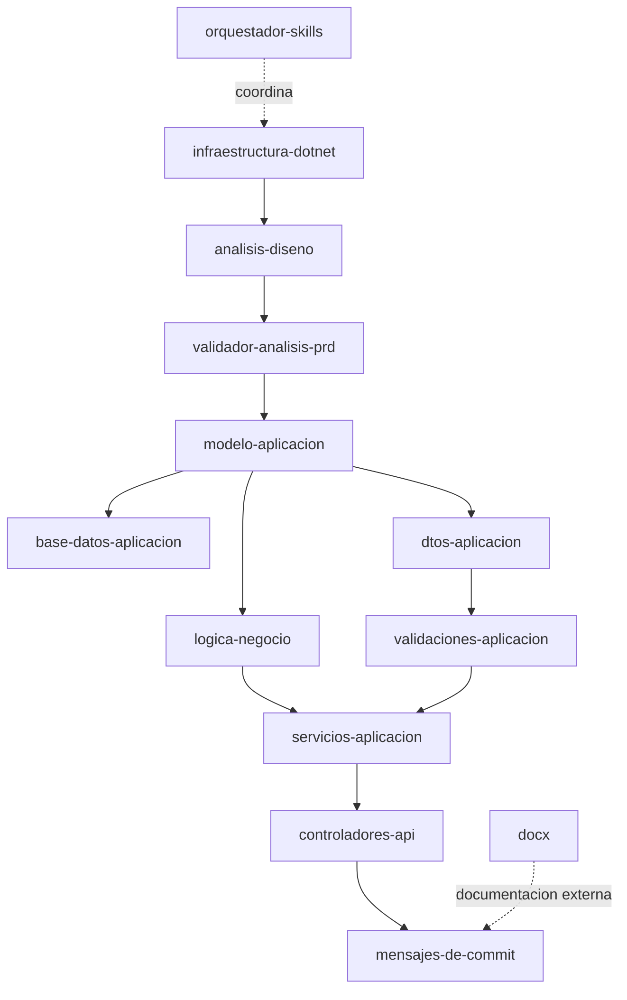
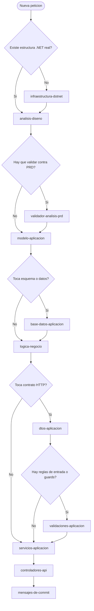

# Orquestacion de Skills

Documento vivo que explica como se coordinan las skills locales de este repositorio. Se mantiene al dia con Mermaid para que el plano sea legible, editable y versionable junto al codigo.

## 1. Objetivo y alcance

Este documento describe el inventario real de skills del repositorio, la secuencia canonica recomendada para trabajar sobre el proyecto y las dependencias que justifican ese orden. Tambien deja escrito el proceso de mantenimiento para que cualquier cambio de skill o de flujo se refleje sin rehacer la documentacion desde cero.

## 2. Inventario de skills locales

| Skill | Ruta | Proposito |
|---|---|---|
| infraestructura-dotnet | .github/skills/infraestructura-dotnet/SKILL.md | Verifica o crea la base minima de un proyecto .NET antes de implementar capas. |
| analisis-diseno | .github/skills/analisis-diseno/SKILL.md | Mantiene actualizado el analisis y diseno tecnico del proyecto. |
| validador-analisis-prd | .github/skills/validador-analisis-prd/SKILL.md | Contrasta PRD y analisis para detectar huecos o desviaciones. |
| modelo-aplicacion | .github/skills/modelo-aplicacion/SKILL.md | Crea o actualiza el modelo de dominio. |
| base-datos-aplicacion | .github/skills/base-datos-aplicacion/SKILL.md | Define el DbContext, el mapeo y las migraciones de EF Core. |
| logica-negocio | .github/skills/logica-negocio/SKILL.md | Encapsula reglas y decisiones de dominio. |
| dtos-aplicacion | .github/skills/dtos-aplicacion/SKILL.md | Crea o actualiza contratos de entrada y salida. |
| validaciones-aplicacion | .github/skills/validaciones-aplicacion/SKILL.md | Aplica validaciones declarativas y guards de dominio. |
| servicios-aplicacion | .github/skills/servicios-aplicacion/SKILL.md | Orquesta casos de uso y registra servicios en Program.cs. |
| controladores-api | .github/skills/controladores-api/SKILL.md | Expone endpoints HTTP de forma ligera y coherente. |
| mensajes-de-commit | .github/skills/mensajes-de-commit/SKILL.md | Redacta mensajes de commit en castellano. |
| docx | .github/skills/docx/SKILL.md | Crea y modifica documentos Word cuando el entregable lo requiere. |
| orquestador-skills | .github/skills/orquestador-skills/SKILL.md | Coordina secuencias enteras de skills con gates intermedios. |

## 3. Secuencia canonica de uso

La secuencia base del repositorio es la siguiente:

1. infraestructura-dotnet
2. analisis-diseno
3. validador-analisis-prd, cuando la validacion contra PRD aporta valor o se pide expresamente
4. modelo-aplicacion
5. base-datos-aplicacion, si el cambio alcanza persistencia, DbContext o migraciones
6. logica-negocio, si el cambio afecta reglas o decisiones de dominio
7. dtos-aplicacion, si el cambio afecta contratos HTTP
8. validaciones-aplicacion, si hay restricciones de entrada o guards de negocio explicitados
9. servicios-aplicacion, si hay logica de aplicacion u orquestacion de casos de uso
10. controladores-api, si el cambio llega a endpoints
11. mensajes-de-commit, al cerrar el cambio y preparar el commit

La secuencia es obligatoria porque cada paso alimenta al siguiente. El documento se mantiene para que esa dependencia se vea de un vistazo.

Nota de arquitectura aplicable a cambios futuros:

- Cuando un cambio implique comprobar existencia de entidades relacionadas o imponer reglas de negocio, la responsabilidad debe moverse a la capa de servicios antes de tocar los controladores.
- En esos casos, los controladores solo deben recibir la petición, invocar al servicio y traducir el resultado o el error a una respuesta HTTP coherente.
- Si el cambio afecta al arranque de la API, conviene preferir operaciones asíncronas como `MigrateAsync` para evitar bloqueos innecesarios.

## 4. Mapa de dependencias

## 5. Arbol de decision

## 6. Convenciones de nombres y rutas

| Regla | Convencion |
|---|---|
| Skills locales | `.github/skills/<nombre>/SKILL.md` |
| Documento vivo de orquestacion | `documentacion/skills-orquestacion.md` |
| Redaccion | Castellano, con foco en el estado real del repo |
| Diagrama | Mermaid dentro del propio Markdown |
| Dependencias | Solo las que se puedan justificar leyendo el `SKILL.md` correspondiente |

## 7. Proceso de actualizacion

Cuando cambia una skill o la relacion entre skills, el mantenimiento de este documento sigue siempre el mismo proceso:

1. Leer los `SKILL.md` afectados y localizar el cambio real.
2. Revisar si cambia el inventario, el orden o los gates.
3. Ajustar la tabla de skills si aparece, desaparece o se renombra alguno.
4. Reescribir los diagramas Mermaid para que reflejen el flujo actual.
5. Actualizar la seccion de pendientes si hay huecos o decisiones abiertas.
6. Confirmar que el documento sigue siendo util como contexto para Copilot y como plano para una persona nueva.

## 8. Pendientes o huecos detectados

- Ninguno por ahora. Si el repositorio incorpora nuevas skills o cambia la secuencia, este apartado debe recogerlo de forma concreta.
